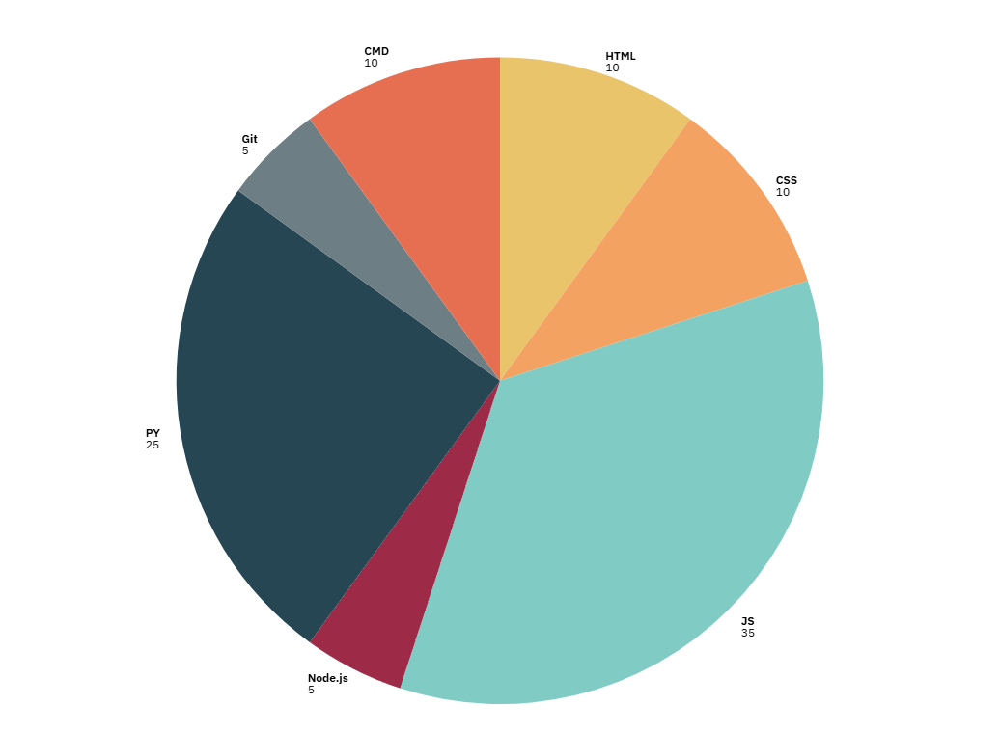

```js
console.log("👋hello i'm VERSE-Web"); //using "" instead of '' because the ' in I'm would interfere.
```
```py
print("👋 Hello, I'm VERSE-Web")
```

> *Self-proclaimed boring, dumb, and totally into codding/osinting. Welcome, fellow newbies and code explorers!*

---

# 💭 Fav Quote

> *Float like a butterfly 🦋, sting 'em like a bee 🐝.*  
> — *Muhammad Ali*

---

# Best Project 📝

- [herro from verser - Mehran Ul Islam](https://open.spotify.com/playlist/7oEYg34WT0Tib6drNLo2Md) - my taste in music.

---

## 🧑‍💻 About Me

- **Full-Stack Web Dev** (or at least trying my best!)
- JavaScript enthusiast, but I probably break more stuff than I fix.
- Always learning, always joking, always a little lost.
- If you’re looking for a “pro,” you’re in the wrong place—but if you want a goofy, welcoming space to talk code, you’re home!

---

## 🚀 Projects

### 📚 [Programming-Wiki](https://github.com/VERSE-Web/Programing-Wiki)
A growing wiki for all things programming, built by a newbie for newbies. If you like chaos, bad spelling, and the thrill of learning something new, check it out!

---

## 🛠️ Tech Stack / Languages I Know

 <h1>Python</h1>
 <h1>Java Script</h1>
 <h1>HTML</h1>
 <h1>CSS</h1>
 <h1>Node.js</h1>
 <h1>Git</h1>
 <h1>CMD</h1>

## Spread Out
 

*Full-stack dabbling: front to back, side to side, upside down… still figuring stuff out 😅*

---

## 🌎 Find Me Elsewhere

<!-- - [Instagram](https://www.instagram.com/casualf1_fan/) — memes, code, and F1 rants  -->
- [GitHub](https://github.com/VERSE-Web/) — obviously  
- [TikTok](https://www.tiktok.com/@user798471769112) — cringe and code  
- [Spotify](https://open.spotify.com/user/31anjyuxi4npl4rbc4ha3xjkl4ze?si=4b81b45f0d18481b) — my questionable music taste

---

## 🤡 Fun Facts

- “I’m boring, dumb and I like codding/osinting.”  
- I believe every expert was once a beginner (and probably still is deep down).  
- Ask me about my latest bug—seriously, I could use the help.

---

## 🦑 Let’s Connect!

If you’re a newbie, a pro, or just bored, drop a message, open an issue, or send a meme my way.  
Let’s make mistakes and learn together!

- 💬 **Discord:** `Boeing.777_200`  
- 📧 **Email:** `mehranislam111@gmail.com`

---

> “Code like nobody’s watching. Because, most of the time, nobody is.”
